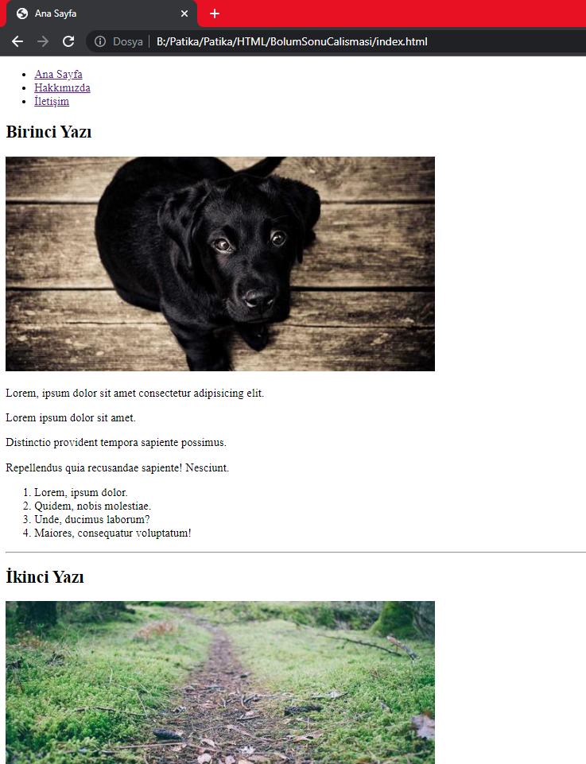
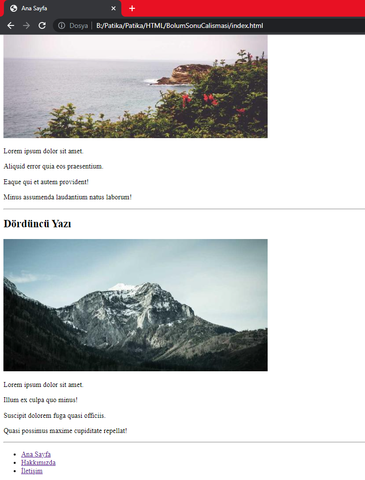
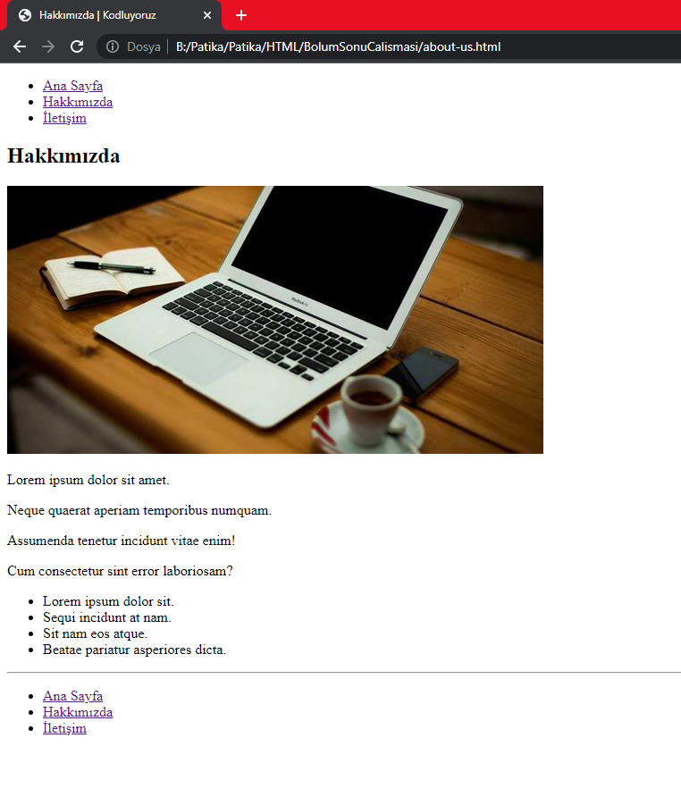
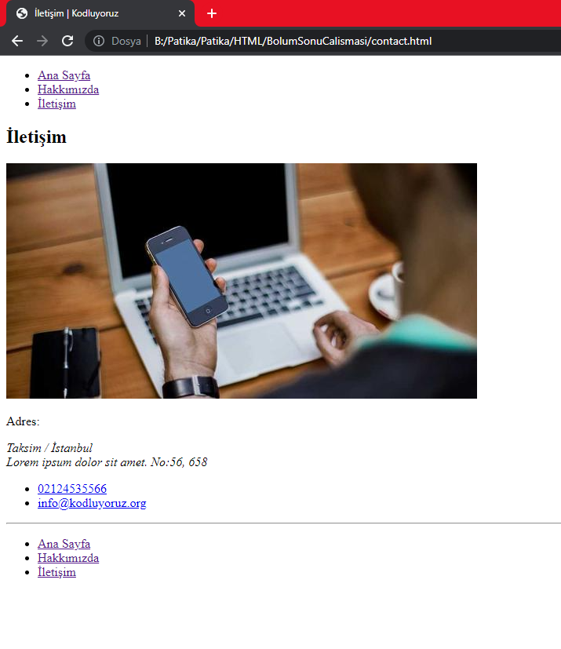

# HTML Bölüm Sonu Çalışması

---
Bu ödev [Patika.dev](https://app.patika.dev/paths) platformundan aldığım [Başlangıç Seviye Frontend Web Development Patikası](https://app.patika.dev/paths/baslangic-seviye-frontend-web-development-patikasi)' na ait olan **HTML** dersinin ödevidir.

Patika Profilim : [ebruzdil](https://app.patika.dev/ebruzdil)  😊✨

---

HTML eğitiminde öğrendiğimiz bilgileri bu repo da uyguladık. Kodların görüntüsü aşağıdaki gibidir.

[index.html](index.html) (Anasayfa) ; 

 

---

[about-us.html](about-us.html) (Hakkımızda) ;

---

[contact.html](contact.html) (İletişim);

