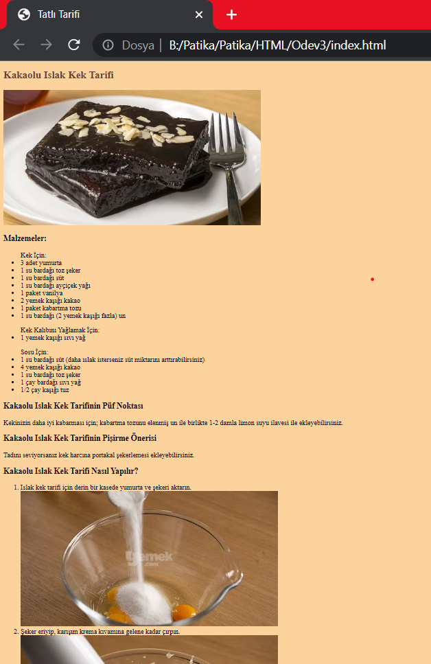
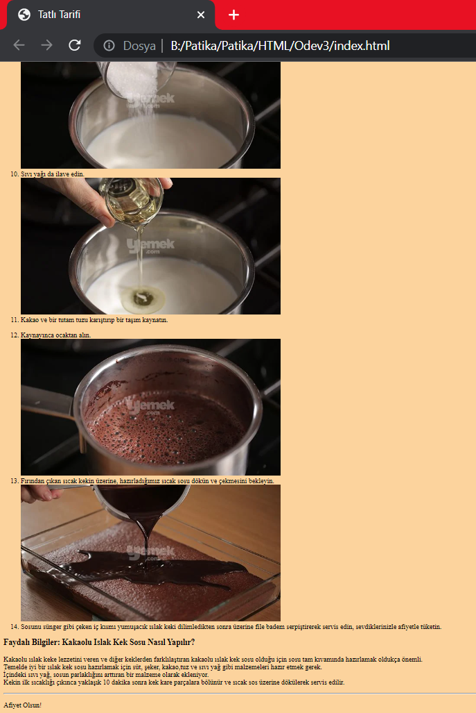

# Ödev 3

Bu ödevimizde sevdiğimiz bir yemek ya da tatlının tarifini öğrendiğimiz bir web sitesini, 
HTML etiketlerini kullanarak yazmaya çalışacağız. Aşağıda yaptığım ödevin site görüntüleri bulunmaktadır.

Kodlar için ->[index.html](index.html)

---

---
Bu ödev [Patika.dev](https://app.patika.dev/paths) platformundan aldığım [Başlangıç Seviye Frontend Web Development Patikası](https://app.patika.dev/paths/baslangic-seviye-frontend-web-development-patikasi)' na ait olan **HTML** dersinin ödevidir.

Patika Profilim : [ebruzdil](https://app.patika.dev/ebruzdil)  😊✨

---

